# Retos Unidad 02: Intro a User Experience Design

## 1. Elige una web de tu preferencia y explica qué partes conforman el UX y qué partes el UI.

- La página que elegí es Last.fm. Este sitio es una red social enfocada en amantes de la música. A continuación dejo una captura de pantalla de cómo se ve el sitio una vez que inicio sesión.

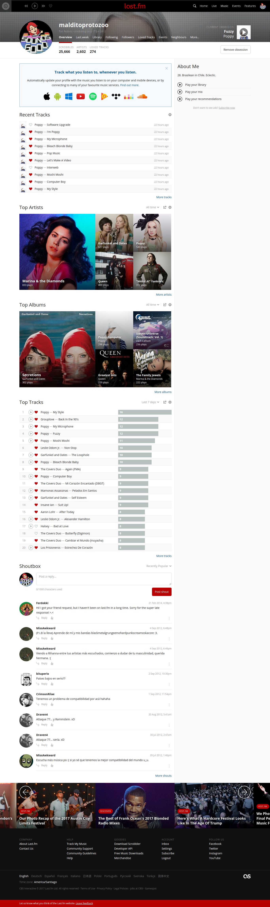

* **UX:** Parte de la experiencia de usuario de Last.fm es poder conectar el sitio a diferentes aplicaciones y sitios de música, como Spotify, Google Play o Deezer. Además, permite conexión entre aplicaciones de música de SO de Android, Windows Phone e iOS. Una vez hecha la conexión, la página acumula datos sobre la música que escuchamos y genera gráficos basados en dicha música como los que muestro a continuación:

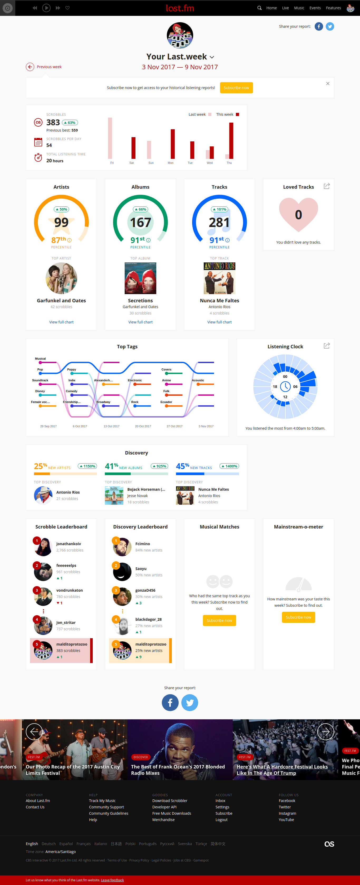

* Las analíticas permiten tener una idea de qué tantos nuevos artistas descubre el usuario durante la semana, cuántas canciones escucha, cuáles son las horas en las que más escucha música, los estilos musicales más populares, entre otros. Gracias a esa información, es posible entrar en contacto con otros usuarios que comparten las mismas preferencias musicales o entrar en contacto con amigos y descubrir música que tengan en común. Last.fm también desarrolla sugerencias en base a la música escuchada y crea listas de reproducción inspiradas en eso. Toda esta información se puede compartir en otras redes sociales como Facebook y Twitter.
* Last.fm proporciona recomendaciones de eventos basados en el sector en donde vives y el usuario se puede subscribir a difentes artistas para recibir notificaciones sobre sus conciertos y lanzamientos recientes.

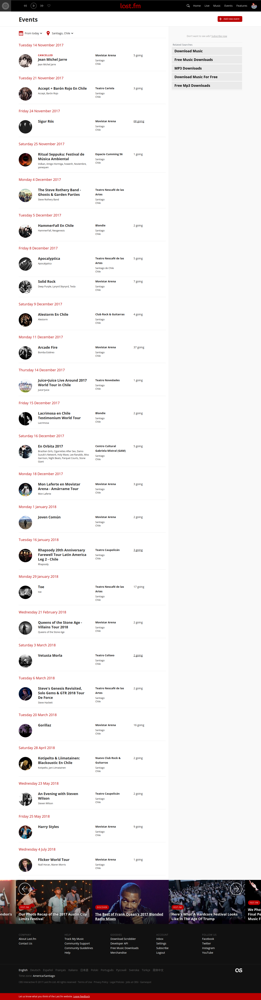

* **UI:** En cuanto a la interfaz de usuario, Last.fm se caracteriza por su presentación sencilla, con detalles en tonos rojos y negros, relacionados al logo de la marca. Tiene una barra de navegación estática que permite el acceso rápido a las principales páginas del sitio y un footer que se mantiene a lo largo de todas las páginas del sitio.

## 2.  Identifica los elementos de navegación en los siguientes sites: Breather, Github y Medium.

* **Breather:** La barra de navegación estática en este sitio así como el menú de hamburguesa que aparece al hacer click en "menu" corresponden a navegación global.

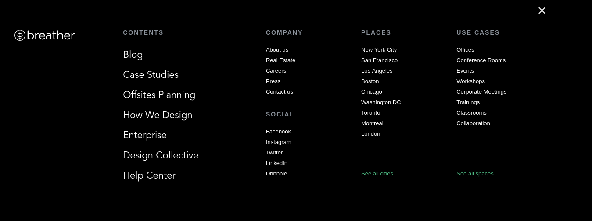

* Más abajo en el sitio existe una sección que corresponde a navegación facetada, pues contiene filtros predefinidos que nos permiten acceder a resultados en distintas categorías.

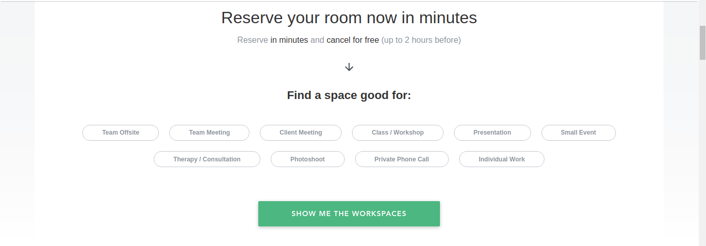

* Luego existe una sección en dónde se le explica a los nuevos usuarios cómo utilizar el sitio. Identifico el tipo de navegación como suplementaria.

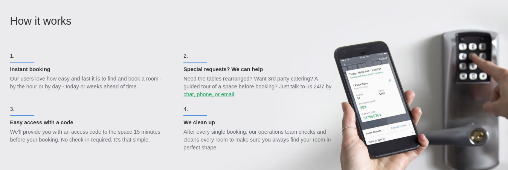

* Dentro de la sección anterior, en el punto dos, existe un link de referencia que podemos considerar como de navegación en línea.

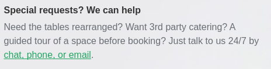

* **Github:** Al igual que en Breather, la barra de navegación superior de Github corresponde a la navegación global.

* Cuando uno entra en la sección "Marketplace", puede encontrar una sección que corresponde a la navegación facetada, pues contiene filtros preestablecidos para buscar herramientas que ayuden a programar mejor.

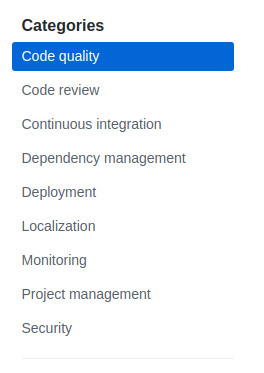

* En la sección "Explore" existe una sección en dónde podemos encontrar recomendaciones de repositorios basados en distintos criterios. Esto corresponde a navegación contextual.

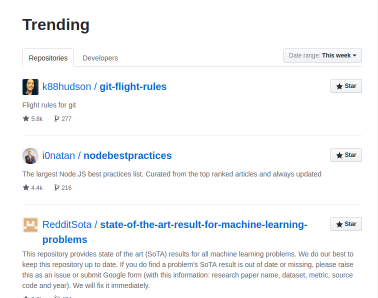

* En la página principal, aparece un pequeño cuadro con un artículo recomendado. Esto también corresponde a navegación contextual:

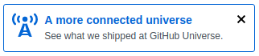

* Cuando uno accede a ese enlace, se encuentra con una sección con artículos. En dicha sección, al extremo derecho, podemos encontrar categorías de artículos, las cuales corresponden a navegación facetada. Dentro del mismo artículo, podemos encontrar un enlace externo que corresponde a navegación lineal.

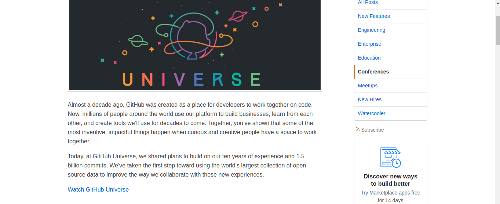

* **Medium:** Al igual que ambas páginas anteriores, Medium contiene una barra de navegación principal en la parte superior (barra fija) que nos permite acceder al resto del sitio. Esta corresponde a navegación global y, al mismo tiempo, a una navegación facetada. Personalmente, me cuesta establecer si es una u otra por el tipo de medio que es Medium.

## 3. Crea un sketch para la herramienta del dashboard de Laboratoria

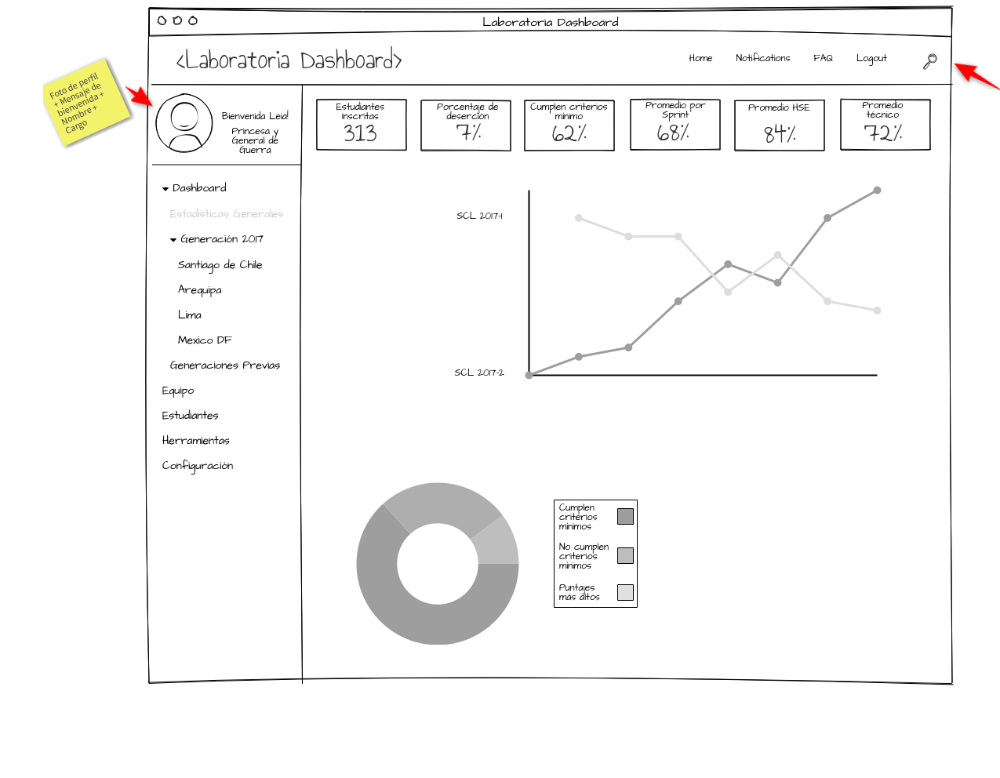
