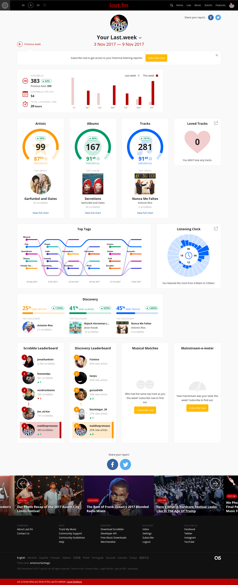
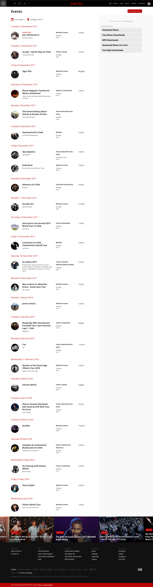

# Retos Unidad 02: Intro a User Experience Design

## 1. Elige una web de tu preferencia y explica qué partes conforman el UX y qué partes el UI.

- La página que elegí es Last.fm. Este sitio es una red social enfocada en amantes de la música. A continuación dejo una captura de pantalla de cómo se ve el sitio una vez que inicio sesión.

* **UX:** Parte de la experiencia de usuario de Last.fm es poder conectar el sitio a diferentes aplicaciones y sitios de música, como Spotify, Google Play o Deezer. Además, permite conexión entre aplicaciones de música de SO de Android, Windows Phone e iOS. Una vez hecha la conexión, la página acumula datos sobre la música que escuchamos y genera gráficos basados en dicha música como los que muestro a continuación:

* Las analíticas permiten tener una idea de qué tantos nuevos artistas descubre el usuario durante la semana, cuántas canciones escucha, cuáles son las horas en las que más escucha música, los estilos musicales más populares, entre otros. Gracias a esa información, es posible entrar en contacto con otros usuarios que comparten las mismas preferencias musicales o entrar en contacto con amigos y descubrir música que tengan en común. Last.fm también desarrolla sugerencias en base a la música escuchada y crea listas de reproducción inspiradas en eso. Toda esta información se puede compartir en otras redes sociales como Facebook y Twitter.
* Last.fm proporciona recomendaciones de eventos basados en el sector en donde vives y el usuario se puede subscribir a difentes artistas para recibir notificaciones sobre sus conciertos y lanzamientos recientes.

* **UI:** En cuanto a la interfaz de usuario, Last.fm se caracteriza por su presentación sencilla, con detalles en tonos rojos y negros, relacionados al logo de la marca. Tiene una barra de navegación estática que permite el acceso rápido a las principales páginas del sitio 
